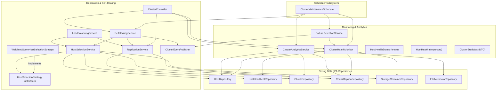
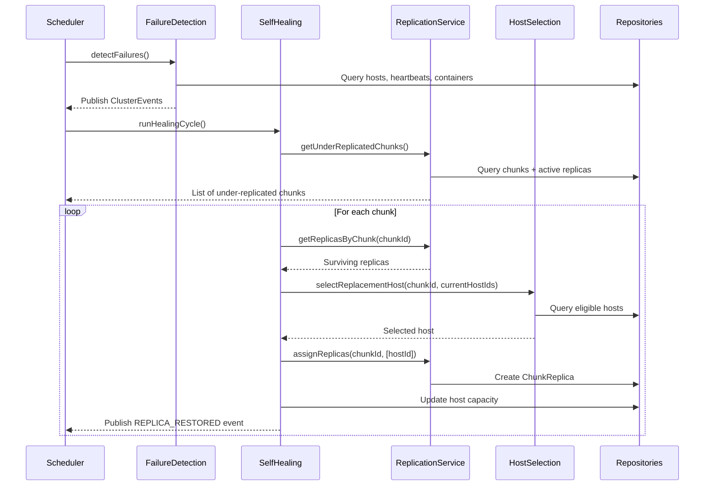

# 🧠 NeuroVault - Distributed Storage Intelligence Layer Documentation

This document explains the architecture, replication algorithm, load balancing strategy, self-healing workflow, REST APIs, and testing framework of the **Distributed Storage Intelligence Layer** implemented in NeuroVault.

---

## 🏛️ System Architecture

NeuroVault divides storage operations into a control plane (Spring Boot metadata coordinator) and a data plane (host fleet). The Distributed Storage Intelligence Layer sits inside the control plane and coordinates replication, load balancing, health monitoring, and self-healing.

### Component Relationship Diagram (Class Diagram)



---

## 🧭 Host Selection & Replication Algorithm

Replication ensures that even if host devices go offline unexpectedly, data is preserved. NeuroVault's default placement algorithm selects the most appropriate storage targets using a pluggable strategy:

1. **Strategy Pattern (`HostSelectionStrategy`):** Decouples host selection logic from caller services, facilitating future geolocation-aware strategies.
2. **Filtering Phase:** Candidate hosts are filtered out if they are:
    - Currently marked `OFFLINE`.
    - Timed out (no heartbeats received for more than the configured timeout).
    - Lacking an `ACTIVE` storage container.
    - Lacking sufficient available capacity to host the chunk.
    - Already storing a replica of the same chunk.
3. **Scoring Phase (`WeightedScoreHostSelectionStrategy`):** Remaining candidates are scored in the range `[0.0, 1.0]` using a weighted formula:
    - **Capacity Availability (Weight: 35%):** $\frac{\text{Available Capacity}}{\text{Total Capacity}}$ (higher available storage scores higher).
    - **Host CPU Load (Weight: 25%):** $1 - \frac{\text{CPU Usage Percent}}{100}$ (idle nodes score higher).
    - **Replica Spread (Weight: 25%):** $\frac{1}{1 + \text{Existing Replica Count}}$ (nodes with fewer chunks score higher to ensure even distribution).
    - **Heartbeat Recency (Weight: 15%):** $1 - \frac{\text{Seconds Since Last Heartbeat}}{\text{Timeout Threshold}}$ (active, responsive nodes score higher).

---

## ⚕️ Self-Healing Workflow

The self-healing engine automatically restores under-replicated chunks without administrator intervention.

### Automatic Replica Recovery Workflow



### Self-Healing Logic Detail
1. **Periodic Scan:** Every 30 seconds, `ClusterMaintenanceScheduler` triggers a failure detection scan.
2. **Offline Host Handling:** Hosts that have exceeded their heartbeat timeout are marked `OFFLINE`. Replicas residing on those offline hosts are transitioned to `MISSING`.
3. **Deficit Detection:** The `ReplicationService` calculates active replica counts for all active chunks. Chunks falling below the default factor (3) are marked under-replicated.
4. **Replacement Selection:** The `SelfHealingService` requests new target placements from the `HostSelectionService` while excluding the surviving hosts to enforce spread constraints.
5. **Replica Restoration:** New `ChunkReplica` metadata records are saved in the database with `ACTIVE` status, restoring the replication factor.

---

## ⚖️ Load Balancing Strategy

The `LoadBalancingService` prevents storage hotspots and spreads storage duties evenly among nodes:

- **Imbalance Metric:** Computed using the **Coefficient of Variation (CV)** of replica counts:
  $$\text{CV} = \frac{\text{Standard Deviation of Replica Counts}}{\text{Mean Replica Count}}$$
- **Trigger:** If $\text{CV} > 0.5$, the cluster is marked as imbalanced, triggering rebalancing.
- **Migration:** Rebalancing relocates replicas from overloaded nodes (replica counts above the mean) to underloaded nodes (replica counts below the mean) while respecting the single-replica-per-node constraint.

---

## 📡 REST API Reference

All cluster monitoring endpoints require standard Bearer JWT authentication (whitelisted requests default to `/api/v1/auth/**`).

### 1. GET `/api/cluster/status`
Returns aggregate statistics of the cluster.
```json
{
  "totalHosts": 3,
  "onlineHosts": 2,
  "offlineHosts": 1,
  "totalStorageBytes": 3000,
  "usedStorageBytes": 1000,
  "availableStorageBytes": 1500,
  "totalFiles": 5,
  "totalChunks": 15,
  "totalReplicas": 45,
  "activeReplicas": 40,
  "missingReplicas": 5,
  "corruptedReplicas": 0,
  "repairCount": 2,
  "recoveryCount": 1,
  "averageReplicationFactor": 2.67,
  "clusterUtilizationPercent": 33.33,
  "timestamp": "2026-07-20T16:00:00"
}
```

### 2. GET `/api/cluster/hosts`
Returns detailed health info of all registered hosts.
```json
[
  {
    "hostId": "4a2b3c4d-5e6f-7a8b-9c0d-1e2f3a4b5c6d",
    "name": "HostNode-1",
    "status": "ONLINE",
    "healthStatus": "HEALTHY",
    "deviceType": "LAPTOP",
    "operatingSystem": "Windows 11",
    "totalCapacityBytes": 5000000000,
    "usedCapacityBytes": 1200000000,
    "reservedCapacityBytes": 500000000,
    "availableCapacityBytes": 3300000000,
    "usagePercent": 24.0,
    "replicaCount": 120,
    "lastHeartbeat": "2026-07-20T15:59:45",
    "containerStatus": "ACTIVE",
    "cpuUsagePercent": 14.5,
    "memoryUsagePercent": 62.0,
    "issues": []
  }
]
```

### 3. GET `/api/cluster/replicas`
Returns replication status and host placements for every chunk.
```json
[
  {
    "chunkId": "e2f3a4b5-c6d7-8e9f-0a1b-2c3d4e5f6a7b",
    "fileId": "1a2b3c4d-5e6f-7a8b-9c0d-1e2f3a4b5c6d",
    "chunkIndex": 0,
    "sizeBytes": 1048576,
    "currentReplicaCount": 3,
    "targetReplicaCount": 3,
    "underReplicated": false,
    "placements": [
      {
        "replicaId": "b5c6d7e8-f9a0-1b2c-3d4e-5f6a7b8c9d0e",
        "hostId": "4a2b3c4d-5e6f-7a8b-9c0d-1e2f3a4b5c6d",
        "hostName": "HostNode-1",
        "status": "ACTIVE"
      }
    ]
  }
]
```

### 4. POST `/api/cluster/repair`
Manually triggers a cluster self-healing run.
```json
{
  "chunksInspected": 5,
  "repairsInitiated": 2,
  "repairsSucceeded": 2,
  "repairsFailed": 0,
  "details": [
    "Chunk e2f3a4b5-c6d7-8e9f-0a1b-2c3d4e5f6a7b: restored 2/2 replicas"
  ],
  "timestamp": "2026-07-20T16:01:10"
}
```

### 5. GET `/api/cluster/health`
Returns the aggregated health assessment.
```json
{
  "healthLevel": "HEALTHY",
  "issues": [],
  "healthyHostCount": 3,
  "unhealthyHostCount": 0,
  "underReplicatedChunks": 0,
  "timestamp": "2026-07-20T16:01:30"
}
```

---

## 🧪 Testing Framework & Verification Guide

Unit and integration tests reside in `backend/src/test/java/com/neurovault/backend/`. They use a fully self-contained in-memory H2 database configured in PostgreSQL compatibility mode.

### Running the Test Suite
From the `backend` folder, run:
```bash
./gradlew test
```

### Test Coverage Highlights

| Test Class | Scope and Scenarios |
| :--- | :--- |
| `WeightedScoreHostSelectionStrategyTest` | Validates host scoring weights, capacity/load calculations, host exclusions (manually excluded, container corrupted, stale heartbeat). |
| `ReplicationServiceTest` | Validates assignment creation, duplicates prevention, replica removal, status updates, deficit computation, and under-replicated chunks retrieval. |
| `SelfHealingServiceTest` | Exercises the auto self-healing cycle, under-replicated recovery, and soft failure handling when eligible hosts are exhausted. |
| `LoadBalancingServiceTest` | Evaluates balanced/imbalanced distributions using standard deviation / coefficient of variation, and migrates replicas from overloaded hosts. |
| `ClusterHealthMonitorTest` | Evaluates single host statuses (online, offline, timed out, container corrupted, low storage) and overall cluster state cascades (HEALTHY/DEGRADED/CRITICAL). |
| `FailureDetectionServiceTest` | Simulates failed conditions and ensures correct alerts are raised, testing that events are deduplicated correctly. |
| `ClusterMaintenanceSchedulerTest` | Checks cleanup of timed-out host heartbeats and status transitions to OFFLINE. |
| `ClusterControllerTest` | Uses MockMvc to verify REST API serialization, JSON structures, mappings, and security context bypass (`@WithMockUser`). |
