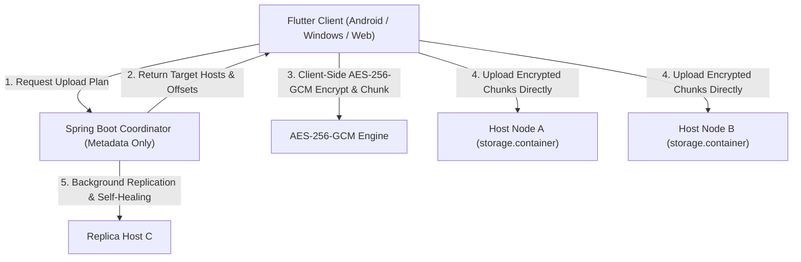

# 🧠 NeuroVault - Zero-Trust Distributed Storage & Micro-Server Fleet System

**NeuroVault** is an enterprise-grade, zero-trust distributed file storage system. It features a high-performance **Java 21 / Spring Boot 3 Metadata-Only Coordinator**, a **Flutter Cross-Platform Client**, **Client-Side AES-256-GCM Encryption**, a 24/7 **Android Foreground Host Service**, and an **In-App Live Debug Console**.

---

## 🔒 Decoupled Metadata-Only Architecture



### Zero-Trust Guarantee
* **Zero Host Invalidation**: Host storage nodes store opaque binary blocks (`storage.container`). The host owner can **never** inspect filenames, directory structures, or unencrypted contents.
* **Client-Side Encryption**: Files are split into 4MB chunks and encrypted with AES-256-GCM using client-generated keys before leaving the user device.
* **Metadata-Only Coordinator**: The central coordinator orchestrates storage reservation, host selection scoring, replication, and self-healing **without ever handling unencrypted file bytes**.

---

## 🛠️ Technology Stack

| Layer | Technology | Key Capabilities |
| :--- | :--- | :--- |
| **Backend Core** | Java 21 (LTS) & Spring Boot 3.3.1 | Metadata-Only Coordinator, Spring Security 6, JWT, JPA |
| **Storage Engine** | Binary Offset Container (`storage.container`) | Pre-allocated binary files, direct offset reads/writes |
| **Frontend App** | Flutter 3.x (Dart 3) & Riverpod | Material 3 UI, Dark Mode, Responsive Layout |
| **Mobile Host** | Android Native Kotlin Foreground Service | 24/7 Uptime, Persistent System Notification, Boot Auto-Start |
| **Cryptography** | AES-256-GCM + SHA-256 | Authenticated encryption, per-chunk integrity checksums |
| **Cloud Sync** | Firebase Storage & Firestore | Dual-mode instant mobile backup & synchronization |
| **In-App Debugger**| In-App Logger (`DebugLogService`) | Real-time on-screen stack traces & log viewer (`DebugConsoleModal`) |

---

## 📂 Repository Structure

```
.
├── backend/                        # Java 21 Spring Boot Backend Core
│   ├── src/main/java/com/neurovault/backend/
│   │   ├── config/                 # Security, JWT & DB Beans
│   │   ├── controller/             # REST Endpoints (/api/auth, /api/files, /api/hosts, /api/cluster)
│   │   ├── entity/                 # JPA Domain Entities (User, Host, FileMetadata, StorageContainer)
│   │   ├── repository/             # Spring Data Repositories
│   │   ├── security/               # JWT Filters & Auth
│   │   ├── service/                # Replication, Self-Healing & Host Selection
│   │   └── storage/                # Binary Offset Storage Engine & Container Manager
│   └── build.gradle                # Dependencies & Build Manifest
│
├── frontend/                       # Flutter Cross-Platform Client
│   ├── android/                    # Android Native Code
│   │   └── app/src/main/kotlin/com/example/frontend/
│   │       ├── HostForegroundService.kt  # 24/7 Android Background Foreground Host Service
│   │       ├── BootReceiver.kt          # Device Reboot Auto-Start Receiver
│   │       └── MainActivity.kt          # MethodChannel Bridge (neurovault/host_service)
│   ├── lib/
│   │   ├── core/                   # Crypto Engine, Firebase Service & Network Client
│   │   │   └── utils/
│   │   │       ├── debug_log_service.dart  # In-App Memory Logger
│   │   │       └── multi_host_test.py      # Multi-Node Test Harness
│   │   ├── features/               # Feature Modules (Auth, Dashboard, Files, Host, Settings)
│   │   │   └── files/screens/
│   │   │       ├── upload_dialog.dart      # 4MB Chunking Modal & Live Progress
│   │   │       └── file_manager_screen.dart# Vault File Manager UI
│   │   └── widgets/
│   │       └── debug_console_modal.dart    # On-Screen In-App Debug Console
│   └── pubspec.yaml                # Flutter Dependencies
│
└── build_and_push_apk.bat          # 1-Click Release APK Compiler & GitHub Sync Script
```

---

## 📡 REST API Reference

### 🔑 Authentication (`/api/auth`)
| Method | Endpoint | Description |
| :--- | :--- | :--- |
| `POST` | `/api/auth/register` | Register user account (`CLIENT`, `HOST`, or `BOTH`) |
| `POST` | `/api/auth/login` | Authenticate user and receive JWT token |

### 🖥️ Host Node Management (`/api/hosts`)
| Method | Endpoint | Description |
| :--- | :--- | :--- |
| `POST` | `/api/hosts/register` | Register new storage host node |
| `GET` | `/api/hosts/my-hosts` | List hosts owned by current user |
| `POST` | `/api/hosts/{hostId}/heartbeat` | Submit node heartbeat & capacity status |

### 📦 Storage & File Pipelines (`/api/files` & `/api/storage`)
| Method | Endpoint | Description |
| :--- | :--- | :--- |
| `POST` | `/api/files/upload-plan` | Request upload session & host allocation plan |
| `POST` | `/api/storage/chunks` | Store encrypted binary chunk on target host node |
| `POST` | `/api/files/upload-complete` | Finalize upload session with chunk metadata |
| `POST` | `/api/files/download-plan/{fileId}`| Fetch download plan & chunk locations |
| `GET` | `/api/storage/chunks/{chunkId}` | Read encrypted chunk payload from host |

### 🌐 Cluster Health & Self-Healing (`/api/cluster`)
| Method | Endpoint | Description |
| :--- | :--- | :--- |
| `GET` | `/api/cluster/status` | Active cluster nodes, total storage & used space |
| `GET` | `/api/cluster/health` | System health status & offline node diagnostics |
| `POST` | `/api/cluster/repair` | Trigger automatic self-healing replication scan |

---

## 🧪 Testing & Verification

### Running Backend Unit & Integration Tests
```powershell
cd backend
.\gradlew.bat test
```
*(All 127 test cases pass cleanly)*

### Running Multi-Host Distributed Simulation Test
```powershell
python frontend\lib\core\utils\multi_host_test.py
```
*(Simulates 3 host nodes, client-side AES encryption, chunk distribution across nodes, SHA-256 integrity verification, and reassembly)*

---

## 🚀 Building Release APK for Android

Compile the production APK and sync automatically with GitHub:
```powershell
.\build_and_push_apk.bat
```
The output APK is located at: `frontend/build/app/outputs/flutter-apk/app-release.apk`.
