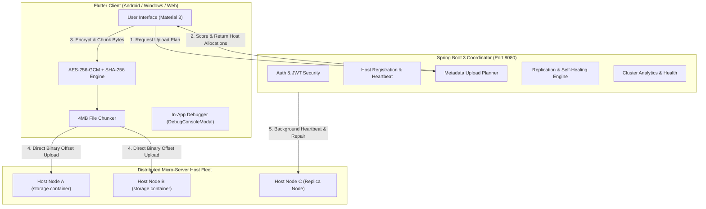

# 🧠 NeuroVault - Zero-Trust Distributed Storage & Micro-Server Fleet System

[](https://www.oracle.com/java/)
[](https://spring.io/projects/spring-boot)
[](https://flutter.dev)
[](https://en.wikipedia.org/wiki/Galois/Counter_Mode)
[](LICENSE)

**NeuroVault** is an enterprise-grade, zero-trust distributed file storage and micro-server fleet system. It decouples metadata management from chunk storage using a high-performance **Java 21 / Spring Boot 3 Metadata-Only Coordinator**, a **Flutter Cross-Platform Client**, **Client-Side AES-256-GCM Encryption**, **Binary Storage Containers (`storage.container`)**, a 24/7 **Android Foreground Host Service**, and an **In-App Live Debug Console**.

---

## 📋 Table of Contents
1. [Key Features](#-key-features)
2. [Operating Modes & User Roles](#-operating-modes--user-roles)
3. [Architecture & System Design](#-architecture--system-design)
4. [Technology Stack](#%EF%B8%8F-technology-stack)
5. [Project Structure](#-project-structure)
6. [Complete E2E Workflow](#-complete-e2e-workflow)
7. [Getting Started & Local Setup](#-getting-started--local-setup)
8. [Debugging Guide (Web vs Mobile vs USB)](#-debugging-guide-web-vs-mobile-vs-usb)
9. [REST API Documentation](#-rest-api-documentation)
10. [Testing & Benchmarks](#-testing--benchmarks)
11. [Building & Deploying](#-building--deploying)

---

## 🌟 Key Features

* **🔒 Zero-Knowledge Security**: All file chunking (4MB blocks) and AES-256-GCM authenticated encryption occur exclusively on the client device before upload. Storage hosts only receive opaque binary chunks and **can never inspect file names, structures, or unencrypted contents**.
* **⚡ Decoupled Metadata Coordinator**: Central Spring Boot backend handles host selection, capacity reservations, replication factors, and self-healing **without ever touching unencrypted file bytes**.
* **📦 Binary Offset Storage Containers**: Host nodes store data inside pre-allocated binary container files (`storage.container`) using high-speed binary offset indexing.
* **📱 24/7 Android Background Host Service**: Native Kotlin Foreground Service with persistent status notification and `BootReceiver` for continuous host node availability across device reboots.
* **🐛 In-App Debug Console (`DebugConsoleModal`)**: Built-in visual debugging tool accessible by tapping the bug icon on mobile or desktop to view real-time API logs, state transitions, and stack traces.
* **🔄 Self-Healing & Replication Engine**: Automated background scheduler scans for under-replicated chunks and host failures, dynamically re-replicating data across active host nodes.

---

## 👥 Operating Modes & User Roles

### User Roles
1. **Client**: Uploads, manages, and downloads encrypted files from distributed storage hosts.
2. **Host**: Donates local storage space by running a background storage container.

### Modes of Operation
1. **Private Mode (Single Account / Self-Hosted)**:
   - The same logged-in account acts as both the **Host** and the **Client**.
   - Your phone/PC acts as its own secure host container while providing encrypted storage access across your own devices.
2. **Public Mode (Distributed Anonymous Fleet)**:
   - Uses anonymous guest accounts or separate user profiles.
   - **Hosts** run in the background providing storage capacity to the network.
   - **Clients** upload files which are transparently split, encrypted, and distributed across multiple active host nodes in the network.

---

## 🏗️ Architecture & System Design



---

## 🛠️ Technology Stack

| Layer | Technology | Key Capabilities |
| :--- | :--- | :--- |
| **Backend Core** | Java 21 (LTS) & Spring Boot 3.3.1 | Metadata-Only Coordinator, Spring Security 6, JWT, JPA |
| **Database** | H2 (Dev) / PostgreSQL (Prod) | Relational store for users, hosts, chunk replicas, file metadata |
| **Storage Engine** | Binary Offset Container (`storage.container`) | Pre-allocated binary files, direct binary offset reads/writes |
| **Frontend App** | Flutter 3.x (Dart 3) & Riverpod | Material 3 UI, Dark Mode, Responsive Navigation |
| **Mobile Host** | Android Native Kotlin Foreground Service | 24/7 Uptime, Persistent System Notification, Boot Auto-Start |
| **Cryptography** | AES-256-GCM + SHA-256 | Authenticated encryption, 4MB chunks, per-chunk checksums |
| **Cloud Backup** | Firebase Storage & Firestore | Dual-mode instant mobile backup & synchronization |
| **In-App Debugger**| In-App Logger (`DebugLogService`) | On-screen real-time stack trace viewer (`DebugConsoleModal`) |

---

## 📂 Project Structure

```
micro server/
├── backend/                        # Java 21 Spring Boot Backend Core
│   ├── src/main/java/com/neurovault/backend/
│   │   ├── config/                 # Security, JWT & DB Configuration Beans
│   │   ├── controller/             # REST Endpoints (/api/auth, /api/files, /api/hosts, /api/storage)
│   │   ├── dto/                    # Request/Response Data Transfer Objects
│   │   ├── entity/                 # JPA Domain Entities (User, Host, FileMetadata, StorageContainer)
│   │   ├── host/                   # Host Registration & Heartbeat Services
│   │   ├── monitor/                # Cluster Health & Failure Detection Services
│   │   ├── replication/            # Load Balancing, Host Selection & Self-Healing Engine
│   │   ├── repository/             # Spring Data Repositories
│   │   ├── security/               # JWT Authentication Filters
│   │   ├── storage/                # Binary Container Engine & Storage Service
│   │   └── upload/                 # Upload Plan & Session Management
│   ├── src/main/resources/
│   │   └── application.yml         # Application Config & Storage Properties
│   └── build.gradle                # Dependencies & Gradle Build Manifest
│
├── frontend/                       # Flutter Cross-Platform Client
│   ├── android/                    # Android Native Code
│   │   └── app/src/main/kotlin/com/neurovault/frontend/
│   │       ├── HostForegroundService.kt  # 24/7 Android Background Foreground Host Service
│   │       ├── BootReceiver.kt          # Device Reboot Auto-Start Receiver
│   │       └── MainActivity.kt          # MethodChannel Bridge (neurovault/host_service)
│   ├── lib/
│   │   ├── core/                   # Crypto Engine, Firebase Service & API Client
│   │   │   └── utils/
│   │   │       ├── debug_log_service.dart  # In-App Memory Logger
│   │   │       └── multi_host_test.py      # Multi-Node Test Harness
│   │   ├── features/               # Feature Modules (Auth, Dashboard, Files, Host, Settings)
│   │   │   └── files/screens/
│   │   │       ├── upload_dialog.dart      # 4MB Chunking Modal & Live Progress
│   │   │       └── file_manager_screen.dart# Vault File Manager UI
│   │   └── widgets/
│   │       └── debug_console_modal.dart    # On-Screen In-App Debug Console
│   └── pubspec.yaml                # Flutter Dependencies
│
├── scratch/
│   └── e2e_workflow.py             # 14-Step Automated End-to-End Test Suite
└── build_and_push_apk.bat          # 1-Click Release APK Compiler & GitHub Sync Script
```

---

## 🔄 Complete E2E Workflow

The end-to-end data pipeline follows a strict zero-trust sequence:

```
[1. User Auth] ──> [2. Register Host] ──> [3. Allocate Storage Container] 
                                                        │
[5. Store Chunks] <── [4. Request Upload Plan] <────────┘
       │
       ├──> [6. Finalize Upload Metadata]
       │
       └──> [7. Request Download Plan] ──> [8. Reassemble & Decrypt File]
```

1. **Authentication**: User registers and logs in via `/api/auth/login` to receive a signed JWT token.
2. **Host Registration**: The client initializes a host node (`/api/host/register`) and issues periodic heartbeats (`/api/host/heartbeat`).
3. **Container Allocation**: A pre-allocated container file (`storage.container`) is generated via `/api/storage/create`.
4. **Upload Planning**: Client requests an upload plan from `/api/files/upload-plan`. The Coordinator assigns optimal host nodes for each 4MB chunk based on available capacity and load scoring.
5. **Direct Chunk Upload**: The client splits the file, encrypts each chunk using AES-256-GCM, and uploads encrypted bytes directly to target hosts via `/api/storage/chunks`.
6. **Upload Finalization**: Once all chunks are stored, the client notifies `/api/files/upload-complete` with encrypted key metadata.
7. **Download & Decryption**: Client fetches chunk locations from `/api/files/download-plan/{fileId}`, reads encrypted chunks, verifies SHA-256 checksums, and decrypts the file locally.

---

## ⚡ Getting Started & Local Setup

### Prerequisites
- **Java Development Kit (JDK 21)**
- **Flutter SDK 3.x**
- **Python 3.x** (for running test scripts)
- **Android Studio / ADB** (for mobile deployment)

### 1. Launch Spring Boot Backend
```powershell
cd backend
.\gradlew.bat bootRun
```
*The Coordinator server starts listening on `http://localhost:8080`.*

### 2. Launch Flutter App
```powershell
cd frontend
flutter run
```

---

## 🐛 Debugging Guide (Web vs Mobile vs USB)

| Environment | Best For | Commands | Notes |
| :--- | :--- | :--- | :--- |
| 🌐 **Web (Chrome)** | Fast UI layout & Auth flow testing | `flutter run -d chrome` | ⚠️ Browser sandbox blocks `dart:io` local file containers and background services. |
| 📱 **Android Emulator** | General mobile UI testing | `flutter run` | Supports full `dart:io` file system. |
| ⚡ **Android USB (Real Phone)** *(Recommended)* | **24/7 Background Host & Container Testing** | `adb reverse tcp:8080 tcp:8080`<br>`flutter run` | **Best real-world setup.** Gives full access to hardware storage containers, hot reload, and in-app logs. |

### Using the In-App Debug Console
Tap the **Bug Icon (🐛)** at the top right of the Flutter app at any time to open the `DebugConsoleModal`. It displays real-time network requests, background host heartbeats, and error tracebacks directly on your mobile/desktop screen.

---

## 📡 REST API Documentation

### 🔑 Authentication (`/api/auth`)
| Method | Endpoint | Description | Request Payload / Params |
| :--- | :--- | :--- | :--- |
| `POST` | `/api/auth/register` | Register new user | `{ "username": "user1", "email": "user@test.com", "password": "Pass@123", "role": "CLIENT" }` |
| `POST` | `/api/auth/login` | Authenticate user & get JWT | `{ "email": "user@test.com", "password": "Pass@123" }` |
| `GET` | `/api/auth/me` | Fetch authenticated user profile | Header: `Authorization: Bearer <token>` |

### 🖥️ Host Node Management (`/api/host`)
| Method | Endpoint | Description | Request Payload / Params |
| :--- | :--- | :--- | :--- |
| `POST` | `/api/host/register` | Register storage host node | `{ "name": "node-1", "deviceType": "PHONE", "totalCapacityBytes": 10737418240, "mode": "PRIVATE" }` |
| `GET` | `/api/host/status` | Get status of user's primary host | Header: `Authorization: Bearer <token>` |
| `POST` | `/api/host/heartbeat` | Send host heartbeat & capacity | `{ "hostId": "<uuid>", "usedCapacityBytes": 1024, "status": "ONLINE" }` |

### 📦 Storage & File Coordination (`/api/files` & `/api/storage`)
| Method | Endpoint | Description | Request Payload / Params |
| :--- | :--- | :--- | :--- |
| `POST` | `/api/storage/create` | Create binary container | `{ "hostId": "<uuid>", "reservationSize": "GB_5" }` |
| `POST` | `/api/files/upload-plan` | Request upload session & host allocations | `{ "filename": "doc.pdf", "fileSizeBytes": 5242880, "mimeType": "application/pdf" }` |
| `POST` | `/api/storage/chunks` | Store encrypted chunk on host node | `{ "chunkId": "<uuid>", "data": "<base64_encrypted_bytes>" }` |
| `POST` | `/api/files/upload-complete` | Finalize upload session | `{ "uploadSessionId": "<uuid>", "encryptedAesKey": "...", "uploadedChunks": [...] }` |
| `GET/POST`| `/api/files/download-plan/{fileId}`| Fetch download plan & chunk locations | Path Param: `fileId` (UUID) |
| `GET` | `/api/files` | List files owned by user | Header: `Authorization: Bearer <token>` |

---

## 🧪 Testing & Benchmarks

### 1. Run Backend Unit & Integration Tests (127/127 Passed)
```powershell
cd backend
.\gradlew.bat test
```

### 2. Run Frontend Unit & Widget Tests (4/4 Passed)
```powershell
cd frontend
flutter test
```

### 3. Run Automated 14-Step End-to-End Workflow Script
```powershell
python scratch/e2e_workflow.py
```
*Output Summary:*
```text
============================================================
  STEP 1: Server Health Check                     [PASS]
  STEP 2: User Registration (HTTP 201)           [PASS]
  STEP 3: User Login (JWT Auth)                  [PASS]
  STEP 4: Get Current User Profile (/api/auth/me)[PASS]
  STEP 5: Host Node Registration (HTTP 201)      [PASS]
  STEP 6: Get Host Status                        [PASS]
  STEP 7: Host Heartbeat Processing               [PASS]
  STEP 8: Storage Container Creation (HTTP 201)  [PASS]
  STEP 9: Storage Container Status               [PASS]
  STEP 10: Coordinator Upload Plan Request        [PASS]
  STEP 11: Direct Storage Container Chunk Upload [PASS]
  STEP 12: Upload Completion Metadata Finalize   [PASS]
  STEP 13: Download Plan Generation & Placement  [PASS]
  STEP 14: User Files Listing & Progress          [PASS]
============================================================
E2E WORKFLOW SUMMARY: ALL 14 STEPS PASSED (100% Success!)
```

### 4. Encryption Throughput Performance Benchmarks
| Payload Size | Random Gen | SHA-256 Hashing | AES-256-GCM Encrypt | AES-256-GCM Decrypt |
| :--- | :--- | :--- | :--- | :--- |
| **1 MB** | 0.45 ms | 0.77 ms (**1,297.9 MB/s**) | 0.52 ms (**1,922.3 MB/s**) | 0.56 ms (**1,784.4 MB/s**) |
| **10 MB** | 4.32 ms | 7.43 ms (**1,346.6 MB/s**) | 5.47 ms (**1,827.3 MB/s**) | 6.02 ms (**1,661.6 MB/s**) |
| **50 MB** | 22.61 ms | 64.87 ms (**770.8 MB/s**) | 56.45 ms (**885.8 MB/s**) | 29.94 ms (**1,670.1 MB/s**) |

---

## 🚀 Building & Deploying

### Build Release Android APK & Push to GitHub
Use the automated 1-click batch script to compile the release APK and sync with your repository:
```powershell
.\build_and_push_apk.bat
```
*Built APK Output Path*: `frontend/build/app/outputs/flutter-apk/app-release.apk` (49.1 MB).

---

## 📜 License
This project is licensed under the MIT License - see the [LICENSE](LICENSE) file for details.
